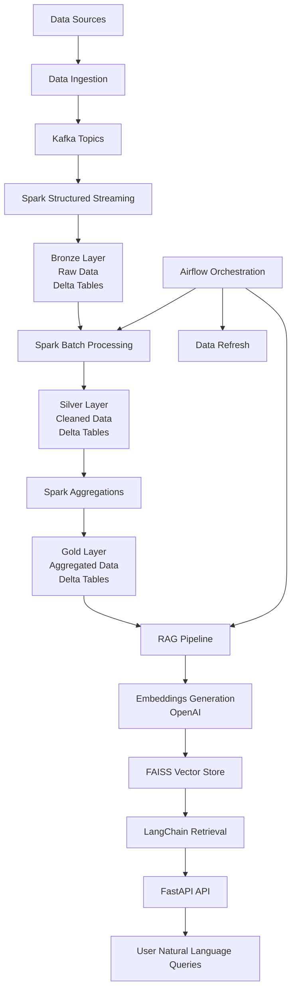

# Architecture Diagram

```mermaid
graph TD
    A[Data Sources] --> B[Data Ingestion]
    B --> C[Kafka Topics]
    C --> D[Spark Structured Streaming]
    D --> E[Bronze Layer<br/>Raw Data<br/>Delta Tables]
    E --> F[Spark Batch Processing]
    F --> G[Silver Layer<br/>Cleaned Data<br/>Delta Tables]
    G --> H[Spark Aggregations]
    H --> I[Gold Layer<br/>Aggregated Data<br/>Delta Tables]
    I --> J[RAG Pipeline]
    J --> K[Embeddings Generation<br/>OpenAI]
    K --> L[FAISS Vector Store]
    L --> M[LangChain Retrieval]
    M --> N[FastAPI API]
    N --> O[User Natural Language Queries]
    P[Airflow Orchestration] --> F
    P --> J
    P --> Q[Data Refresh]
```